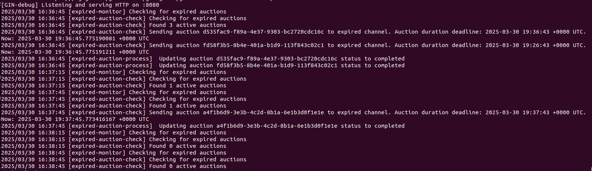
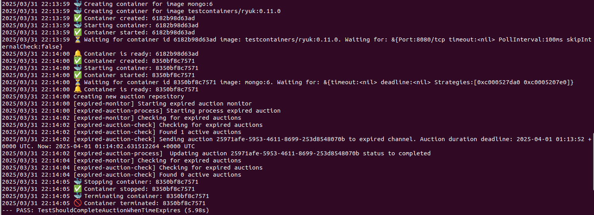

# go-auction

## Lab Requirements
### Objective
Add a new feature to the existing project to automatically close the auction after a defined period.

Clone/Fork the following repository: [devfullcycle/labs-auction-goexpert](https://github.com/devfullcycle/labs-auction-goexpert)

### Overview
The entire auction creation and bidding process has already been developed. However, the cloned project needs an improvement: adding an automatic closing routine based on a predefined time.

For this task, you will use **Go routines** and focus on the **auction creation process**. The validation to check whether an auction is open or closed during new bids is already implemented.

### Implementation Details
You should implement the solution in the following file:

📂 `internal/infra/database/auction/create_auction.go`

### Requirements
- Develop a function to calculate the auction duration based on parameters defined in environment variables.
- Implement a new Go routine to check for expired auctions (where the time has run out) and update their status to closed.
- Write a test to validate that the auction is being closed automatically.

## Local environment setup (Docker)
To run the project locally, you need to have Docker installed on your machine.

Run the following command to start the project:
```bash
make run
```

To clean up the project, including the database, run the following command:
```bash
make down
```

### Project startup
The initial setup will create a database using the content of the `./docker/database/mongo-init.js` file.
This file contains 3 users and 3 auctions.
- Auction of Volkswagen Golf (`d535fac9-f89a-4e37-9303-bc2720cdc16c`), will have the timestamp of the current moment.
- Auction of Ford Mustang (`fd58f3b5-8b4e-401a-b1d9-113f843c02c1`), will have the timestamp of the current moment less 10 minutes.
- Auction of Tesla Model S (`a4f1b6d9-3e3b-4c2d-8b1a-6e1b3d0f1e1e`), will have the timestamp of the current moment plus 1 minute.

The environment variable `AUCTION_DURATION` is used to set the duration of the auctions in seconds. The preset value is 30s (`./cmd/auction/.env`). (Default value: 5 minutes)

When a `AuctionRepository` is created, two main goroutines will be created:
- **expired auction monitor**: a goroutine will be created to check the auctions that have expired (timestamp + duration) sending it to the expired channel. The goroutine will check for expired auctions every 30 seconds (`AUCTION_DURATION`).
- **process expired auction**: a goroutine will be created to listen to the expired channel and will update the auction status to `completed`.

In this way, when the application starts, the following scenario will happen:
- The **expired auction monitor** goroutine will start the `ticker` and, in the first 30 seconds, the auctions of Volkswagen Golf (`d535fac9-f89a-4e37-9303-bc2720cdc16c`) and Ford Mustang (`fd58f3b5-8b4e-401a-b1d9-113f843c02c1`) will be processed and the status will be updated to `completed`.

- The next monitor cycle will find the active auction of Tesla Model S (`a4f1b6d9-3e3b-4c2d-8b1a-6e1b3d0f1e`), but it will not be processed because the auction does not have an expired timestamp yet. (The auction will expire only the current moment plus 30 seconds).

- The next monitor cycle will find the active auction of Tesla Model S (`a4f1b6d9-3e3b-4c2d-8b1a-6e1b3d0f1e`), and it will be processed because the auction has an expired timestamp. Its status will be updated to `completed`.



## Integration test for the expired auction feature
To run the integration test, you need to have Docker and Go installed on your machine. The integration test uses the `testcontainers` library to create a MongoDB container and run the tests.

To run the integration test, run the following command in the root directory of the project:
```bash
make integration-test
```

